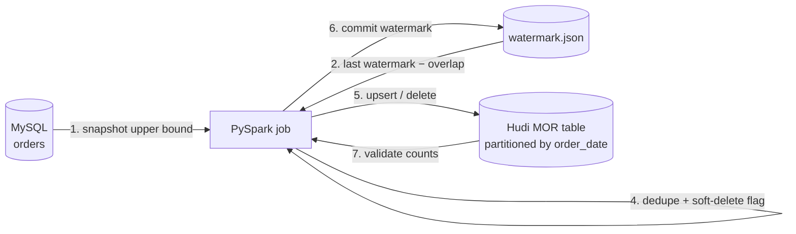

# MySQL → Apache Hudi Incremental Pipeline (PySpark)

A production-style **PySpark** job that moves a busy MySQL OLTP table into an **Apache Hudi (Merge-on-Read)** lake table on HDFS/S3. It is incremental, idempotent and delete-aware.

> A self-contained demo on dummy e-commerce data, showing the patterns I use for large MySQL-to-lake migrations. No proprietary code or data is included.

## What it does



| Step | Detail |
|---|---|
| Snapshot upper bound | `MAX(updated_at)` is fixed at the start, so rows that change during the run are left for the next run |
| Overlap window | Re-reads the last N minutes to catch long-running transactions that commit late; duplicates are removed by Hudi's precombine |
| Parallel extract | One `MIN/MAX/COUNT` query, then `numPartitions` JDBC reads split on the primary key |
| Deletes | `is_deleted = 1` in MySQL becomes `_hoodie_is_deleted = true`, so the record is removed from the lake |
| Write | `bulk_insert` for the first load and `upsert` after that; MOR table with inline compaction every 3 commits and ZSTD parquet |
| Watermark | Committed **after** a successful write, with an atomic file replace. A failed run is simply re-run |
| Validation | Active source rows vs lake rows; the job exits non-zero on mismatch (useful for alerting) |

## Design decisions

- **Merge-on-Read instead of Copy-on-Write.** Frequent small upserts go to log files instead of rewriting whole parquet files. For upsert-heavy tables this typically makes each incremental write many times faster, at the cost of periodic compaction.
- **SIMPLE index.** The partition value comes from `created_at`, which never changes for a key, so a global index is not needed.
- **The watermark is read as a string in the source's time zone.** This avoids silent JVM / JDBC-driver time-zone shifts, a real bug class when source servers run in IST and Spark runs in UTC.
- **A `flock` in `run.sh`** stops overlapping cron runs.

## Project structure

```
pipeline/
  mysql_to_hudi.py   entry point (full | incremental)
  extract.py         parallel JDBC extraction, snapshot bound
  transform.py       dedupe, soft delete, partition column (pure functions)
  load.py            Hudi writer + Parquet fallback for local runs
  watermark.py       atomic JSON watermark store
config/pipeline.json source / target / state settings
scripts/generate_data.py  dummy data: seed + daily churn (updates, deletes, inserts)
sql/init.sql         source table + read-only ETL user
tests/               pytest unit tests
run.sh               spark-submit wrapper (YARN or local)
```

## Run it

```bash
# 1. Source database
docker compose up -d
pip install -r requirements.txt
python scripts/generate_data.py --mode seed --rows 100000

# 2. First load, then simulate a day of changes and load incrementally
export MYSQL_PASSWORD=etl_reader
./run.sh full
python scripts/generate_data.py --mode churn --updates 5000 --deletes 500 --inserts 2000
./run.sh incremental

# On a Hadoop cluster
SPARK_MASTER=yarn ./run.sh incremental --deploy-mode client --num-executors 4 --executor-memory 4g
```

No Hudi jars available? Use the Parquet fallback to test the logic end-to-end:

```bash
spark-submit --packages com.mysql:mysql-connector-j:8.4.0 pipeline/mysql_to_hudi.py --mode full --sink parquet --validate
```

Sample run (local, Parquet fallback):

```
INFO pipeline.extract - Source window updated_at <= '2026-09-26 13:23:48.960000' -> 100000 rows
INFO mysql_to_hudi - Validation OK: source active rows=100000, lake rows=100000
... churn: 5000 updates, 500 soft-deletes, 2000 inserts ...
INFO mysql_to_hudi - Writing 102000 rows (500 deletes) to /tmp/lake/shop_demo/orders [parquet]
INFO mysql_to_hudi - Validation OK: source active rows=101500, lake rows=101500
```

Query the lake:

```python
spark.read.format("hudi").load("hdfs:///lake/shop_demo/orders") \
     .groupBy("city").sum("amount").show()
```

## Tests

```bash
python -m pytest -q tests     # dedupe, delete flag, watermark bounds, atomic state file
```

## Possible extensions

- CDC with Debezium → Kafka → Hudi DeltaStreamer for near real-time.
- Register the table in Hive Metastore and query it through Spark Thrift Server or Trino.
- Orchestrate with Airflow (sensor on the source, retries, SLA alerts).

---
**Author:** Mahendra H Seth, Senior Data Engineer (Hadoop · PySpark · Hudi · Delta Lake · MySQL)
